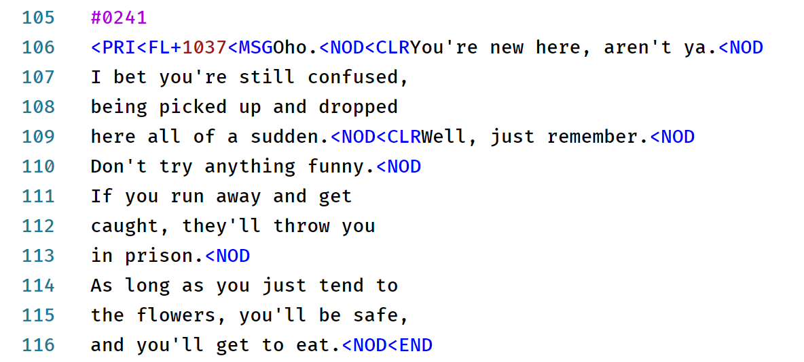
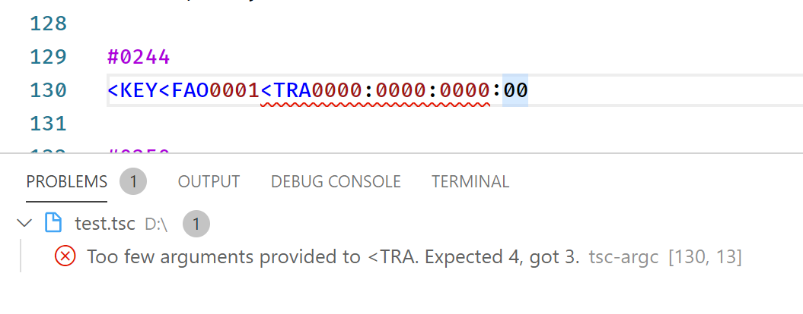
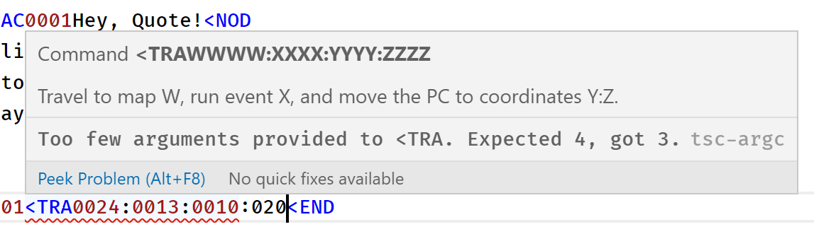
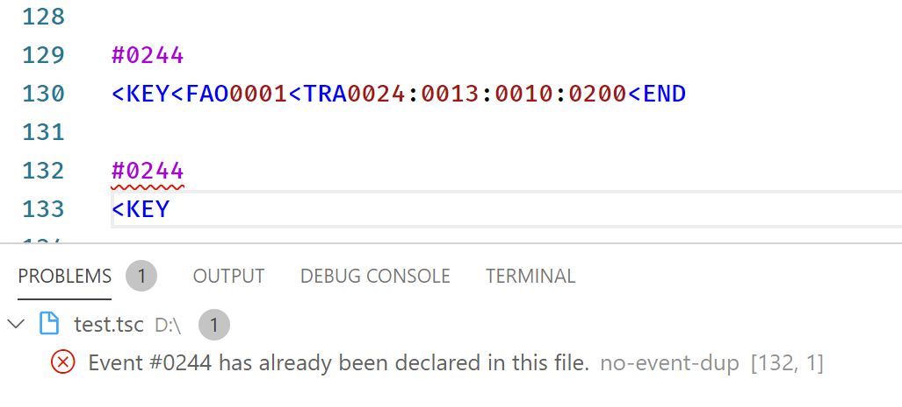
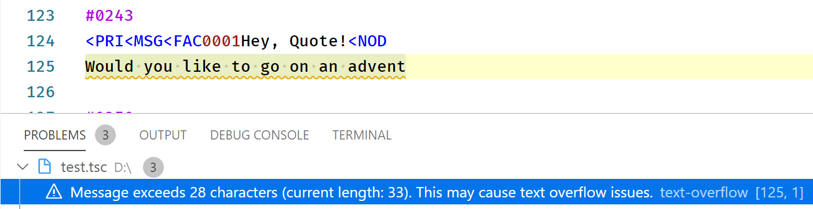

# TSC Language Tooling

This repository contains two components: a language server for the TSC format, as well as a language client for Visual Studio Code. TSC is the scripting language used in Cave Story.

Currently, both of these components are in a very early stage, so bugs may appear and some things might feel weird.

## Features

### VSCode Plugin

- Syntax highlighting



### Language Server

- Command autocompletion


- Command syntax checker



- Helpful messages for commands on hover



- Event duplication checker



- Warning on messagebox overflow



## Planned Features

- Event folding (client)
- Helpful general attribute tooltips (server)
- `.tscrc.json` for configurable settings (such as safe textbox length) and custom commands (such as `<MIM`)

## Contribution

**1. Clone the repo:**

```sh
git clone git@github.com:jozsefsallai/tsc-language-tooling.git
```

**2. Install the dependencies:**

```sh
npm i
```

**3. Watch or compile:**

```sh
npm run watch
npm run compile
```

Don't forget to make sure that your changes pass the linter:

```sh
npm run lint
```

## License

MIT. Cave Story (Doukutsu Monogatari) is the property of Daisuke "Pixel" Amaya and Nicalis, Inc.
